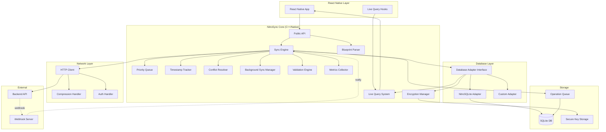
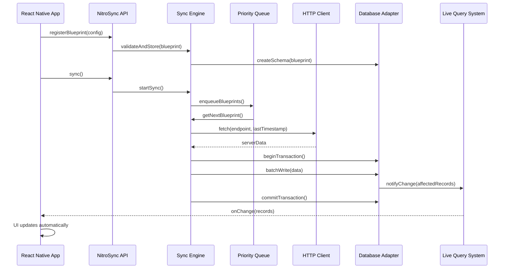
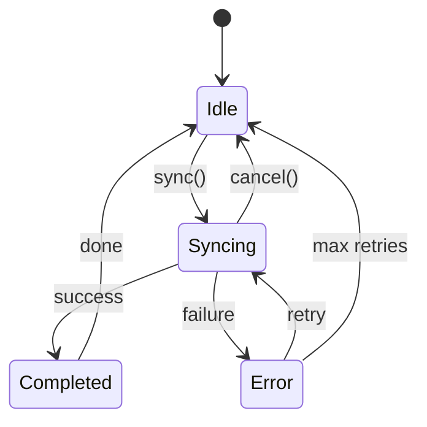
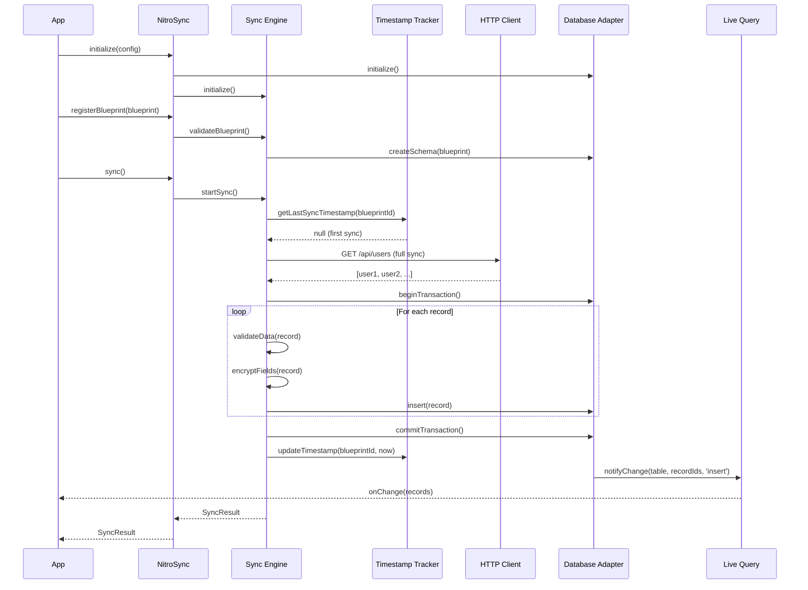
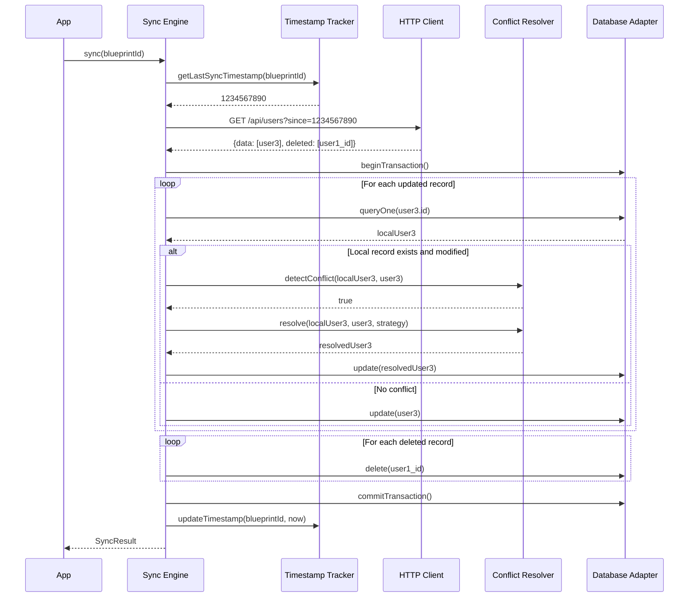
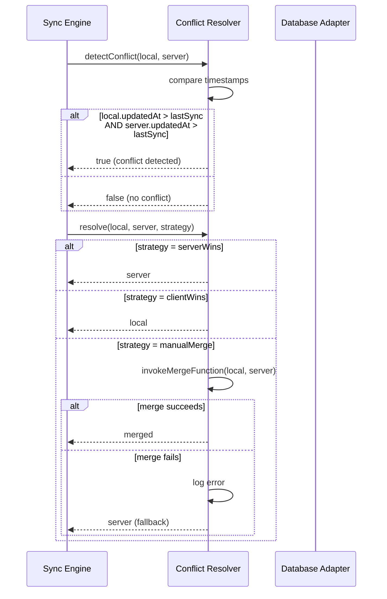
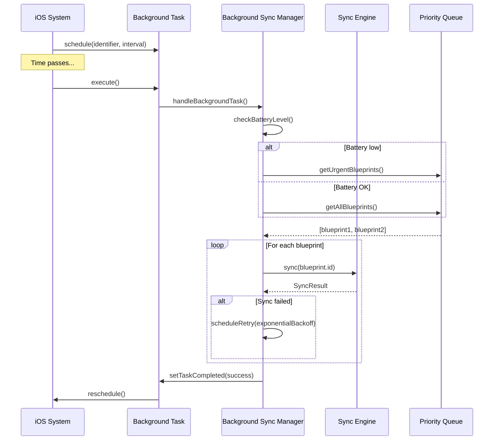
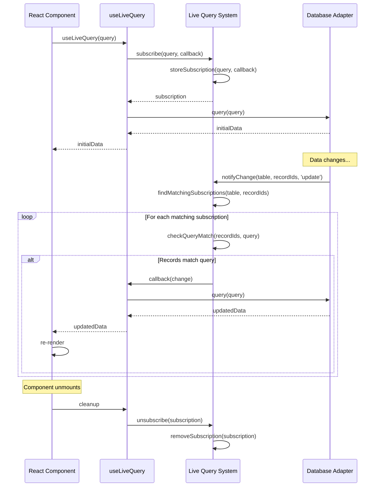
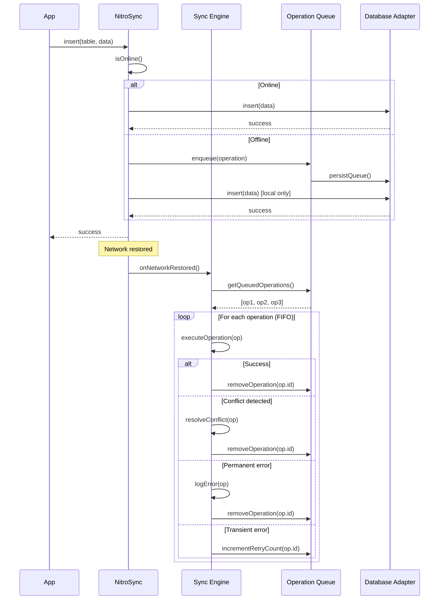
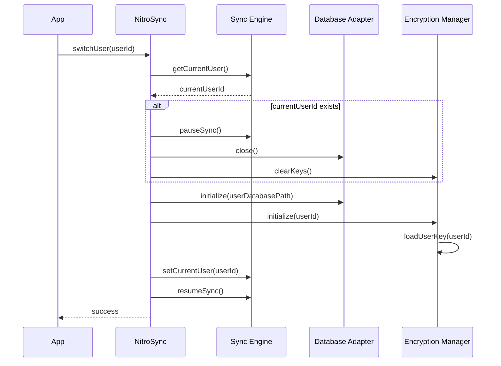

# Design Document: NitroSync Backend-Agnostic Sync Engine

## Overview

NitroSync is a high-performance, backend-agnostic synchronization engine for React Native applications. It bridges the gap between remote APIs and local mobile databases through a declarative Blueprint configuration system, enabling developers to integrate any backend without writing custom sync logic.

### Core Design Principles

1. **Backend Agnosticism**: Blueprint-based configuration allows mapping any REST API to local storage
2. **Performance First**: Native module implementation using React Native Nitro for optimal read/write speeds
3. **Pluggable Architecture**: Interface-based design enables custom database adapters and conflict resolvers
4. **Offline-First**: Queue-based operation management ensures seamless offline functionality
5. **Security by Default**: Field-level encryption with platform-specific secure key storage
6. **Developer Experience**: Declarative configuration, live queries, and comprehensive monitoring

### Technology Stack

- **Core Framework**: React Native Nitro modules (C++ for iOS/Android)
- **Default Database**: SQLite with native bindings
- **Encryption**: AES-256 with platform-specific key storage (iOS Keychain, Android KeyStore)
- **Background Sync**: iOS BackgroundTasks framework, Android WorkManager
- **Compression**: gzip for network payload optimization
- **Event System**: Native event emitters for cross-language communication

## Architecture

### High-Level System Architecture



### Component Interaction Flow



## Components and Interfaces

### 1. Sync Engine

The orchestrator component responsible for coordinating all synchronization operations.

**Responsibilities:**
- Manage sync lifecycle (initial, incremental, background)
- Coordinate between network, database, and conflict resolution
- Handle retry logic with exponential backoff
- Emit sync state changes and progress events
- Manage operation queue for offline scenarios

**Key Methods:**
```typescript
interface SyncEngine {
  // Lifecycle
  initialize(config: NitroSyncConfig): Promise<void>;
  registerBlueprint(blueprint: Blueprint): Promise<void>;
  
  // Sync operations
  sync(blueprintId?: string): Promise<SyncResult>;
  syncWithPriority(priority: Priority): Promise<SyncResult>;
  cancelSync(blueprintId: string): void;
  
  // State management
  getSyncState(blueprintId: string): SyncState;
  onSyncStateChange(callback: (state: SyncState) => void): Subscription;
  
  // Offline queue
  queueOperation(operation: Operation): Promise<void>;
  processQueue(): Promise<void>;
  getQueuedOperations(): Operation[];
}
```

**State Machine:**


### 2. Blueprint Parser

Validates and parses Blueprint configurations into internal data structures.

**Responsibilities:**
- Validate Blueprint JSON/JavaScript structure
- Parse field mappings and transformations
- Validate authentication configuration
- Generate database schema from Blueprint
- Support Blueprint versioning

**Blueprint Schema:**
```typescript
interface Blueprint {
  id: string;
  version: number;
  priority: 'urgent' | 'normal' | 'lazy';
  
  endpoint: {
    url: string;
    method: 'GET' | 'POST';
    headers?: Record<string, string>;
    auth?: AuthConfig;
  };
  
  sync: {
    strategy: 'full' | 'incremental';
    timestampField?: string;
    changeDetection?: 'webhook' | 'polling';
    backgroundInterval?: number; // minutes
  };
  
  database: {
    table: string;
    primaryKey: string;
    indexes?: string[];
  };
  
  fields: FieldMapping[];
  
  conflictResolution: {
    strategy: 'serverWins' | 'clientWins' | 'manualMerge';
    mergeFunction?: string; // function name for manual merge
  };
  
  validation?: ValidationRules;
  compression?: boolean;
}

interface FieldMapping {
  apiField: string;
  dbColumn: string;
  type: 'string' | 'number' | 'boolean' | 'date' | 'json';
  encrypted?: boolean;
  required?: boolean;
  transform?: string; // function name for custom transformation
}
```

### 3. Database Adapter Interface

Pluggable interface for different database implementations.

**Interface Definition:**
```typescript
interface DatabaseAdapter {
  // Lifecycle
  initialize(config: DatabaseConfig): Promise<void>;
  close(): Promise<void>;
  
  // Schema management
  createTable(schema: TableSchema): Promise<void>;
  migrateSchema(fromVersion: number, toVersion: number): Promise<void>;
  getSchemaVersion(): Promise<number>;
  
  // Read operations
  query(sql: string, params?: any[]): Promise<QueryResult>;
  queryOne(sql: string, params?: any[]): Promise<Record<string, any> | null>;
  batchQuery(queries: Query[]): Promise<QueryResult[]>;
  
  // Write operations
  insert(table: string, data: Record<string, any>): Promise<number>;
  batchInsert(table: string, data: Record<string, any>[]): Promise<number[]>;
  update(table: string, data: Record<string, any>, where: WhereClause): Promise<number>;
  batchUpdate(table: string, updates: UpdateOperation[]): Promise<number>;
  delete(table: string, where: WhereClause): Promise<number>;
  
  // Transaction management
  beginTransaction(): Promise<Transaction>;
  commit(transaction: Transaction): Promise<void>;
  rollback(transaction: Transaction): Promise<void>;
  
  // Performance
  createIndex(table: string, columns: string[]): Promise<void>;
  vacuum(): Promise<void>;
}
```

**NitroSQLiteAdapter Implementation:**
- Uses native SQLite bindings for maximum performance
- Implements connection pooling for concurrent operations
- Supports WAL mode for better concurrency
- Implements prepared statement caching
- Target: <16ms for reads under 1000 records, <50ms for batch writes under 100 records

### 4. Conflict Resolver

Handles conflicts between local and server data during synchronization.

**Responsibilities:**
- Detect conflicts using modification timestamps
- Apply configured resolution strategy
- Invoke custom merge functions for manual resolution
- Log conflict resolution decisions
- Fallback to ServerWins on merge errors

**Conflict Detection:**
```typescript
interface ConflictResolver {
  detectConflict(local: Record, server: Record): boolean;
  resolve(local: Record, server: Record, strategy: ConflictStrategy): Record;
  registerMergeFunction(name: string, fn: MergeFunction): void;
}

type MergeFunction = (local: Record, server: Record) => Record;

interface ConflictStrategy {
  type: 'serverWins' | 'clientWins' | 'manualMerge';
  mergeFunctionName?: string;
}
```

**Conflict Detection Algorithm:**
1. Compare `updatedAt` timestamps (or configured timestamp field)
2. If local timestamp > last sync timestamp AND server timestamp > last sync timestamp → conflict
3. Apply resolution strategy
4. Log conflict details for debugging

### 5. Timestamp Tracker

Maintains last successful sync timestamp per Blueprint for incremental sync.

**Responsibilities:**
- Store last sync timestamp per Blueprint
- Persist timestamps across app restarts
- Provide timestamp for incremental sync requests
- Update timestamp on successful sync completion

**Storage Schema:**
```sql
CREATE TABLE sync_timestamps (
  blueprint_id TEXT PRIMARY KEY,
  last_sync_timestamp INTEGER NOT NULL,
  last_sync_status TEXT NOT NULL,
  records_synced INTEGER DEFAULT 0,
  updated_at INTEGER NOT NULL
);
```

### 6. Background Sync Manager

Manages synchronization when app is in background or closed.

**Platform-Specific Implementation:**

**iOS (BackgroundTasks):**
```typescript
interface IOSBackgroundSyncManager {
  registerBackgroundTask(identifier: string): void;
  scheduleBackgroundSync(interval: number): void;
  handleBackgroundTask(task: BGTask): Promise<void>;
}
```

**Android (WorkManager):**
```typescript
interface AndroidBackgroundSyncManager {
  schedulePeriodicWork(interval: number, constraints: Constraints): void;
  scheduleOneTimeWork(delay: number): void;
  cancelWork(workId: string): void;
}
```

**Constraints:**
- Respect battery level (defer non-urgent on low battery)
- Require network connectivity
- Respect system background limits
- Use exponential backoff for failures

### 7. Live Query System

Provides reactive data updates to React Native UI layer.

**Responsibilities:**
- Allow subscription to database queries
- Detect data changes matching subscribed queries
- Emit change notifications within 16ms
- Batch notifications for transaction changes
- Auto-cleanup on component unmount

**API:**
```typescript
interface LiveQuerySystem {
  subscribe(query: Query, callback: ChangeCallback): Subscription;
  unsubscribe(subscription: Subscription): void;
  notifyChange(table: string, recordIds: string[], changeType: ChangeType): void;
}

interface ChangeCallback {
  (change: ChangeNotification): void;
}

interface ChangeNotification {
  table: string;
  recordIds: string[];
  changeType: 'insert' | 'update' | 'delete';
  timestamp: number;
}
```

**React Native Hook:**
```typescript
function useLiveQuery<T>(query: Query): T[] {
  const [data, setData] = useState<T[]>([]);
  
  useEffect(() => {
    const subscription = NitroSync.subscribe(query, (change) => {
      // Re-fetch and update data
      NitroSync.query(query).then(setData);
    });
    
    return () => subscription.unsubscribe();
  }, [query]);
  
  return data;
}
```

### 8. Encryption Manager

Handles field-level encryption and decryption with secure key management.

**Responsibilities:**
- Encrypt fields marked in Blueprint before storage
- Decrypt fields on read operations
- Generate and manage encryption keys per device
- Store keys in platform-specific secure storage
- Support per-user encryption keys for multi-tenant

**Implementation:**
```typescript
interface EncryptionManager {
  initialize(userId?: string): Promise<void>;
  encrypt(value: string, fieldName: string): Promise<string>;
  decrypt(encryptedValue: string, fieldName: string): Promise<string>;
  rotateKey(userId: string): Promise<void>;
  deleteKey(userId: string): Promise<void>;
}
```

**Key Management:**
- Algorithm: AES-256-GCM
- Key derivation: PBKDF2 with device-specific salt
- iOS: Store in Keychain with kSecAttrAccessibleWhenUnlockedThisDeviceOnly
- Android: Store in KeyStore with StrongBox if available
- Per-user keys for multi-tenant support

### 9. Priority Queue

Orders sync operations based on Blueprint priority levels.

**Responsibilities:**
- Maintain priority-ordered queue of Blueprints
- Support urgent, normal, and lazy priorities
- Allow interruption of lazy syncs by urgent syncs
- Respect bandwidth constraints

**Implementation:**
```typescript
interface PriorityQueue {
  enqueue(blueprint: Blueprint): void;
  dequeue(): Blueprint | null;
  peek(): Blueprint | null;
  remove(blueprintId: string): void;
  clear(): void;
  size(): number;
}
```

**Priority Rules:**
1. Urgent > Normal > Lazy
2. Within same priority: FIFO
3. Urgent can interrupt Lazy (not Normal)
4. Low bandwidth: only Urgent syncs

### 10. Validation Engine

Validates data against Blueprint rules before storage.

**Responsibilities:**
- Validate required fields
- Validate field types
- Execute custom validation functions
- Provide detailed error messages
- Prevent invalid data storage

**Validation Rules:**
```typescript
interface ValidationRules {
  [fieldName: string]: FieldValidation;
}

interface FieldValidation {
  required?: boolean;
  type?: 'string' | 'number' | 'boolean' | 'date' | 'email' | 'url';
  min?: number;
  max?: number;
  pattern?: string; // regex
  custom?: string; // function name
}

interface ValidationEngine {
  validate(data: Record<string, any>, rules: ValidationRules): ValidationResult;
  registerValidator(name: string, fn: ValidatorFunction): void;
}

type ValidatorFunction = (value: any, field: string) => boolean | string;
```

### 11. Metrics Collector

Tracks performance metrics for monitoring and optimization.

**Metrics Tracked:**
- Sync duration per Blueprint
- Network bytes transferred (up/down)
- Records synced per operation
- Database operation durations
- Error rates and types
- Queue depth over time

**API:**
```typescript
interface MetricsCollector {
  recordSyncStart(blueprintId: string): void;
  recordSyncEnd(blueprintId: string, result: SyncResult): void;
  recordNetworkBytes(blueprintId: string, bytes: number): void;
  recordDatabaseOperation(operation: string, duration: number): void;
  getMetrics(blueprintId?: string): Metrics;
  exportMetrics(): string; // JSON format
}

interface Metrics {
  blueprintId: string;
  totalSyncs: number;
  averageDuration: number;
  totalBytesTransferred: number;
  totalRecordsSynced: number;
  errorRate: number;
  lastSync: number;
}
```

## Data Models

### Blueprint Configuration

Complete Blueprint structure with all optional fields:

```typescript
interface Blueprint {
  // Identity
  id: string;
  name: string;
  version: number;
  description?: string;
  
  // Priority
  priority: 'urgent' | 'normal' | 'lazy';
  
  // API Configuration
  endpoint: {
    url: string;
    method: 'GET' | 'POST' | 'PUT' | 'DELETE';
    headers?: Record<string, string>;
    queryParams?: Record<string, string>;
    auth?: {
      type: 'bearer' | 'basic' | 'apiKey' | 'custom';
      tokenField?: string; // where to get token from
      headerName?: string; // for apiKey
      customAuthFunction?: string; // function name
    };
  };
  
  // Sync Configuration
  sync: {
    strategy: 'full' | 'incremental';
    timestampField?: string; // field name in API response
    deletionMarkerField?: string; // field indicating deletion
    changeDetection?: {
      type: 'webhook' | 'polling';
      webhookPath?: string;
      pollingInterval?: number; // seconds
    };
    backgroundInterval?: number; // minutes
    batchSize?: number; // records per request
  };
  
  // Database Configuration
  database: {
    table: string;
    primaryKey: string;
    indexes?: string[];
    uniqueConstraints?: string[][];
  };
  
  // Field Mappings
  fields: FieldMapping[];
  
  // Conflict Resolution
  conflictResolution: {
    strategy: 'serverWins' | 'clientWins' | 'manualMerge';
    mergeFunction?: string;
    timestampField?: string; // for conflict detection
  };
  
  // Validation
  validation?: ValidationRules;
  
  // Performance
  compression?: boolean;
  cacheResults?: boolean;
  cacheTTL?: number; // seconds
  
  // Multi-tenant
  userScoped?: boolean; // isolate per user
}
```

### Sync State

Internal state tracking for each Blueprint:

```typescript
interface SyncState {
  blueprintId: string;
  status: 'idle' | 'syncing' | 'completed' | 'error';
  progress?: {
    total: number;
    current: number;
    percentage: number;
  };
  lastSync?: {
    timestamp: number;
    duration: number;
    recordsSynced: number;
    bytesTransferred: number;
  };
  error?: {
    code: string;
    message: string;
    timestamp: number;
    retryCount: number;
  };
  queuedOperations: number;
}
```

### Operation Queue

Offline operations waiting for sync:

```typescript
interface QueuedOperation {
  id: string;
  blueprintId: string;
  type: 'insert' | 'update' | 'delete';
  table: string;
  data: Record<string, any>;
  timestamp: number;
  retryCount: number;
  userId?: string; // for multi-tenant
}
```

**Storage Schema:**
```sql
CREATE TABLE operation_queue (
  id TEXT PRIMARY KEY,
  blueprint_id TEXT NOT NULL,
  operation_type TEXT NOT NULL,
  table_name TEXT NOT NULL,
  data_json TEXT NOT NULL,
  created_at INTEGER NOT NULL,
  retry_count INTEGER DEFAULT 0,
  user_id TEXT,
  FOREIGN KEY (blueprint_id) REFERENCES blueprints(id)
);

CREATE INDEX idx_operation_queue_created ON operation_queue(created_at);
CREATE INDEX idx_operation_queue_user ON operation_queue(user_id);
```

### Database Schema Generation

NitroSync generates SQLite schema from Blueprint:

```typescript
// Example Blueprint field mappings
fields: [
  { apiField: 'id', dbColumn: 'id', type: 'string' },
  { apiField: 'email', dbColumn: 'email', type: 'string', encrypted: true },
  { apiField: 'name', dbColumn: 'name', type: 'string' },
  { apiField: 'created_at', dbColumn: 'created_at', type: 'date' },
  { apiField: 'metadata', dbColumn: 'metadata', type: 'json' }
]

// Generated SQL
CREATE TABLE users (
  id TEXT PRIMARY KEY,
  email TEXT NOT NULL,
  name TEXT NOT NULL,
  created_at INTEGER NOT NULL,
  metadata TEXT,
  _updated_at INTEGER NOT NULL,
  _synced_at INTEGER,
  _encrypted_fields TEXT
);

CREATE INDEX idx_users_created_at ON users(created_at);
```

**System Columns:**
- `_updated_at`: Local modification timestamp for conflict detection
- `_synced_at`: Last successful sync timestamp for this record
- `_encrypted_fields`: JSON array of encrypted field names

### Multi-Tenant Database Structure

```sql
-- User isolation table
CREATE TABLE nitrosync_users (
  user_id TEXT PRIMARY KEY,
  database_path TEXT NOT NULL,
  encryption_key_id TEXT NOT NULL,
  created_at INTEGER NOT NULL,
  last_active INTEGER NOT NULL
);

-- Each user gets isolated database file
-- Path: {app_data}/nitrosync/{user_id}/data.db
```


## API Specifications

### Public NitroSync API

The main API exposed to React Native developers:

```typescript
class NitroSync {
  // Initialization
  static initialize(config: NitroSyncConfig): Promise<void>;
  static shutdown(): Promise<void>;
  
  // Blueprint Management
  static registerBlueprint(blueprint: Blueprint): Promise<void>;
  static unregisterBlueprint(blueprintId: string): Promise<void>;
  static getBlueprint(blueprintId: string): Blueprint | null;
  static listBlueprints(): Blueprint[];
  
  // Sync Operations
  static sync(blueprintId?: string): Promise<SyncResult>;
  static syncUrgent(): Promise<SyncResult>;
  static cancelSync(blueprintId: string): void;
  static syncInBackground(): Promise<void>;
  
  // State Monitoring
  static getSyncState(blueprintId: string): SyncState;
  static onSyncStateChange(
    callback: (state: SyncState) => void
  ): Subscription;
  static onSyncProgress(
    blueprintId: string,
    callback: (progress: SyncProgress) => void
  ): Subscription;
  
  // Database Operations
  static query<T>(
    table: string,
    where?: WhereClause,
    options?: QueryOptions
  ): Promise<T[]>;
  static queryOne<T>(
    table: string,
    where: WhereClause
  ): Promise<T | null>;
  static insert(
    table: string,
    data: Record<string, any>
  ): Promise<string>;
  static update(
    table: string,
    data: Record<string, any>,
    where: WhereClause
  ): Promise<number>;
  static delete(
    table: string,
    where: WhereClause
  ): Promise<number>;
  
  // Live Queries
  static subscribe<T>(
    query: Query,
    callback: (data: T[]) => void
  ): Subscription;
  
  // Offline Queue
  static getQueuedOperations(): QueuedOperation[];
  static clearQueue(): Promise<void>;
  static processQueue(): Promise<void>;
  
  // Multi-Tenant
  static switchUser(userId: string): Promise<void>;
  static deleteUser(userId: string): Promise<void>;
  static getCurrentUser(): string | null;
  
  // Metrics
  static getMetrics(blueprintId?: string): Metrics;
  static exportMetrics(): string;
  
  // Utilities
  static isOnline(): boolean;
  static getNetworkStatus(): NetworkStatus;
  static clearCache(): Promise<void>;
}
```

### Configuration Types

```typescript
interface NitroSyncConfig {
  // Database
  databaseAdapter?: DatabaseAdapter; // defaults to NitroSQLiteAdapter
  databasePath?: string; // defaults to app data directory
  
  // Network
  timeout?: number; // request timeout in ms, default 30000
  maxConcurrentSyncs?: number; // default 3
  retryAttempts?: number; // default 3
  retryBackoff?: 'linear' | 'exponential'; // default exponential
  
  // Performance
  enableCache?: boolean; // default true
  cacheSize?: number; // MB, default 50
  enableCompression?: boolean; // default true
  
  // Security
  enableEncryption?: boolean; // default true
  encryptionKeyDerivation?: 'pbkdf2' | 'scrypt'; // default pbkdf2
  
  // Background Sync
  enableBackgroundSync?: boolean; // default true
  backgroundSyncInterval?: number; // minutes, default 15
  
  // Logging
  logLevel?: 'debug' | 'info' | 'warn' | 'error'; // default info
  logToFile?: boolean; // default false
  
  // Multi-Tenant
  multiTenant?: boolean; // default false
}
```

### Query API

```typescript
interface Query {
  table: string;
  where?: WhereClause;
  orderBy?: OrderBy[];
  limit?: number;
  offset?: number;
  select?: string[]; // specific columns
}

interface WhereClause {
  [column: string]: any | WhereOperator;
}

interface WhereOperator {
  $eq?: any;
  $ne?: any;
  $gt?: any;
  $gte?: any;
  $lt?: any;
  $lte?: any;
  $in?: any[];
  $nin?: any[];
  $like?: string;
  $between?: [any, any];
}

interface OrderBy {
  column: string;
  direction: 'ASC' | 'DESC';
}

interface QueryOptions {
  includeDeleted?: boolean; // default false
  decrypt?: boolean; // default true
}
```

### Result Types

```typescript
interface SyncResult {
  blueprintId: string;
  success: boolean;
  recordsSynced: number;
  bytesTransferred: number;
  duration: number;
  errors?: SyncError[];
}

interface SyncError {
  code: string;
  message: string;
  details?: any;
}

interface SyncProgress {
  blueprintId: string;
  total: number;
  current: number;
  percentage: number;
  estimatedTimeRemaining?: number; // ms
}

interface Subscription {
  unsubscribe(): void;
}
```

## Workflow Sequences

### Initial Sync Workflow



### Incremental Sync Workflow



### Conflict Resolution Workflow



### Background Sync Workflow (iOS)



### Live Query Workflow



### Offline Operation Queue Workflow



### Multi-Tenant User Switch Workflow




## Security Considerations

### Encryption Architecture

**Field-Level Encryption:**
- AES-256-GCM for authenticated encryption
- Unique encryption key per device (or per user in multi-tenant mode)
- Transparent encryption/decryption at Database Adapter layer
- Only marked fields are encrypted, minimizing performance impact

**Key Management:**
- iOS: Keychain with `kSecAttrAccessibleWhenUnlockedThisDeviceOnly`
- Android: KeyStore with StrongBox Backed Keys (when available)
- Key derivation: PBKDF2 with 100,000 iterations
- Device-specific salt stored separately from encrypted data
- No keys stored in application code or preferences

**Multi-Tenant Security:**
- Isolated database files per user
- Per-user encryption keys
- Automatic key cleanup on user deletion
- No shared memory between user sessions
- Secure user switching with memory clearing

### Authentication

**API Authentication:**
- Support for Bearer tokens, Basic auth, API keys, and custom auth
- Token refresh handling with automatic retry
- Secure token storage in platform keychain/keystore
- Auth failure events for app-level handling

**Local Database:**
- No authentication required (device-level security)
- Encryption provides data-at-rest protection
- File system permissions prevent cross-app access

### Data Protection

**In Transit:**
- HTTPS required for all API communication
- Certificate pinning support (optional)
- Compression after encryption to prevent information leakage
- Request/response validation

**At Rest:**
- Field-level encryption for sensitive data
- SQLite database file protected by OS file permissions
- Secure deletion of user data on logout/deletion
- No plaintext sensitive data in logs

**In Memory:**
- Minimal sensitive data retention
- Automatic cleanup on user logout
- No sensitive data in crash reports
- Secure memory clearing for encryption keys

### Threat Model

**Protected Against:**
- Device theft (encrypted data at rest)
- Malicious apps (OS-level file isolation)
- Network interception (HTTPS + optional pinning)
- Memory dumps (minimal sensitive data retention)
- Backup extraction (device-specific keys)

**Not Protected Against:**
- Compromised device (root/jailbreak)
- Malicious backend (app must validate server)
- Physical device access while unlocked
- OS-level vulnerabilities

## Performance Optimization Strategies

### Database Performance

**Indexing Strategy:**
- Automatic index creation for primary keys
- Blueprint-specified indexes for common queries
- Composite indexes for multi-column queries
- Periodic ANALYZE for query optimization

**Connection Management:**
- Connection pooling for concurrent operations
- WAL mode for better read/write concurrency
- Prepared statement caching
- Batch operations for bulk inserts/updates

**Query Optimization:**
- Query result caching with configurable TTL
- Lazy loading for large result sets
- Projection queries (select specific columns)
- Query plan analysis for slow queries

**Performance Targets:**
- Read queries: <16ms for <1000 records
- Write operations: <50ms for <100 records
- Live query notifications: <16ms delivery
- Background sync: <5% battery impact per hour

### Network Performance

**Request Optimization:**
- Incremental sync to minimize data transfer
- gzip compression for payloads >1KB
- Request batching for multiple entities
- Connection reuse with HTTP/2

**Bandwidth Management:**
- Priority-based sync (urgent first)
- Bandwidth detection (WiFi vs cellular)
- Configurable batch sizes
- Pause/resume for large syncs

**Caching Strategy:**
- HTTP cache headers support
- ETag-based conditional requests
- Local cache for frequently accessed data
- Cache invalidation on sync

### Memory Management

**Memory Efficiency:**
- Streaming for large datasets
- Pagination for query results
- Automatic cleanup of unused subscriptions
- Weak references for callbacks

**Memory Targets:**
- Base memory: <10MB
- Per-Blueprint overhead: <1MB
- Live query overhead: <100KB per subscription
- Operation queue: <5MB for 1000 operations

### Background Sync Optimization

**Battery Efficiency:**
- Exponential backoff for failures
- Defer non-urgent syncs on low battery
- Batch multiple Blueprint syncs
- Respect system background limits

**Scheduling Strategy:**
- Opportunistic sync on network change
- Coalesce multiple sync requests
- Adaptive intervals based on data change frequency
- User activity-aware scheduling

### Monitoring and Profiling

**Performance Metrics:**
- Sync duration per Blueprint
- Database operation times
- Network request latency
- Memory usage over time
- Battery impact estimation

**Optimization Tools:**
- Built-in performance profiler
- Slow query logging
- Network traffic analysis
- Memory leak detection


## Correctness Properties

*A property is a characteristic or behavior that should hold true across all valid executions of a system-essentially, a formal statement about what the system should do. Properties serve as the bridge between human-readable specifications and machine-verifiable correctness guarantees.*

### Property 1: Blueprint Serialization Round-Trip

*For any* valid Blueprint configuration, serializing to JSON then parsing back should produce an equivalent Blueprint object with all fields preserved.

**Validates: Requirements 1.1, 1.2, 1.11**

### Property 2: Blueprint Validation Rejects Invalid Structures

*For any* Blueprint configuration with invalid structure (missing required fields, invalid types, or malformed data), the Blueprint_Parser should reject it and return a descriptive error message.

**Validates: Requirements 1.3, 1.4**

### Property 3: Blueprint Registration Persistence

*For any* valid Blueprint, after registering it with the Sync_Engine, retrieving the Blueprint by ID should return an equivalent Blueprint configuration.

**Validates: Requirements 1.10**

### Property 4: Initial Sync Triggers Full Data Fetch

*For any* set of registered Blueprints, when no local data exists, initiating sync should fetch all data from the server for each Blueprint.

**Validates: Requirements 2.2**

### Property 5: Sync Progress Reporting

*For any* sync operation in progress, the Sync_Engine should emit progress events containing current and total record counts.

**Validates: Requirements 2.3**

### Property 6: Successful Sync Updates Timestamp

*For any* Blueprint, when a sync operation completes successfully, the Timestamp_Tracker should record a timestamp that is greater than or equal to the sync start time.

**Validates: Requirements 2.4, 3.5**

### Property 7: Sync Retry with Exponential Backoff

*For any* sync operation that fails with a transient error, the Sync_Engine should retry up to the configured maximum attempts with exponentially increasing delays between attempts.

**Validates: Requirements 2.5, 13.1, 13.2**

### Property 8: Failed Sync Error Persistence

*For any* sync operation that fails after all retries, the Sync_Engine should store error details and emit an error event to the application.

**Validates: Requirements 2.6, 13.3, 13.4**

### Property 9: Incremental Sync Uses Last Timestamp

*For any* Blueprint with a recorded last sync timestamp, starting a sync operation should include that timestamp in the API request to fetch only changed records.

**Validates: Requirements 3.1, 3.2, 3.3, 3.4**

### Property 10: Server Change Markers Applied Locally

*For any* incremental sync response containing deletion markers, update markers, or creation markers, the Sync_Engine should apply the corresponding delete, update, or insert operations to local data.

**Validates: Requirements 3.6, 3.7, 3.8**

### Property 11: Read Query Performance

*For any* database query on a dataset under 1000 records, the Database_Adapter should return results within 16ms.

**Validates: Requirements 4.2**

### Property 12: Indexed Query Optimization

*For any* query on an indexed column, execution time should be faster than the same query on a non-indexed column for datasets over 100 records.

**Validates: Requirements 4.3**

### Property 13: Batch Read Operations

*For any* set of multiple read queries, executing them as a batch operation should complete faster than executing them individually.

**Validates: Requirements 4.4**

### Property 14: Query Result Caching

*For any* query executed twice within the cache TTL period, the second execution should return cached results without hitting the database.

**Validates: Requirements 4.6**

### Property 15: Batch Write Operations Support

*For any* set of insert, update, or delete operations, the Database_Adapter should support executing them as a single batch operation.

**Validates: Requirements 5.2, 5.3, 5.4**

### Property 16: Transactional Write Integrity

*For any* write operation, if any part of the operation fails, all changes should be rolled back; if all parts succeed, all changes should be committed atomically.

**Validates: Requirements 5.5, 5.6, 5.7**

### Property 17: Write Operation Performance

*For any* batch write operation with under 100 records, the Database_Adapter should complete within 50ms.

**Validates: Requirements 5.8**

### Property 18: Conflict Resolution Strategy Application

*For any* detected conflict between local and server data, the Conflict_Resolver should apply the configured strategy (ServerWins, ClientWins, or ManualMerge) and produce a resolved record.

**Validates: Requirements 6.5, 6.6, 6.7, 6.8**

### Property 19: Conflict Detection by Timestamp

*For any* local and server record pair, a conflict should be detected if and only if both records have modification timestamps greater than the last sync timestamp.

**Validates: Requirements 6.9**

### Property 20: ManualMerge Error Fallback

*For any* conflict with ManualMerge strategy, if the merge function throws an error, the Conflict_Resolver should fall back to ServerWins strategy and log the error.

**Validates: Requirements 6.10**

### Property 21: Background Sync Scheduling

*For any* Blueprint with a configured background sync interval, the Background_Sync_Manager should schedule periodic sync operations at the specified interval.

**Validates: Requirements 7.3**

### Property 22: Background Sync Execution

*For any* scheduled background sync operation, when the app is in background and conditions are met (network available, sufficient battery), the sync should execute.

**Validates: Requirements 7.5**

### Property 23: Battery-Aware Sync Deferral

*For any* non-urgent Blueprint, when device battery is low, the Background_Sync_Manager should defer sync operations until battery level improves.

**Validates: Requirements 7.6**

### Property 24: Network-Aware Sync Deferral

*For any* sync operation, when network is unavailable, the Sync_Engine should defer the operation until connectivity is restored.

**Validates: Requirements 7.7**

### Property 25: Background Sync Timestamp Update

*For any* background sync that completes successfully, the Timestamp_Tracker should be updated with the completion timestamp.

**Validates: Requirements 7.9**

### Property 26: Priority Queue Ordering

*For any* set of Blueprints with different priority levels, the Priority_Queue should order them such that Urgent > Normal > Lazy, and within the same priority level, maintain FIFO order.

**Validates: Requirements 8.5, 8.6, 8.7**

### Property 27: Bandwidth-Limited Urgent-Only Sync

*For any* sync operation when network bandwidth is limited, the Sync_Engine should sync only Urgent_Priority Blueprints.

**Validates: Requirements 8.8**

### Property 28: Urgent Sync Preemption

*For any* Lazy_Priority sync in progress, when an Urgent_Priority sync is requested, the Sync_Engine should interrupt the lazy sync and start the urgent sync.

**Validates: Requirements 8.9**

### Property 29: Custom Database Adapter Registration

*For any* custom Database_Adapter implementation, after registering it with NitroSync, all database operations should use the custom adapter instead of the default.

**Validates: Requirements 9.7, 9.8**

### Property 30: Field Encryption Round-Trip

*For any* field marked for encryption in a Blueprint, encrypting then decrypting the field value should produce the original value.

**Validates: Requirements 10.2, 10.3**

### Property 31: Unique Encryption Keys Per Device

*For any* two different devices (or users in multi-tenant mode), the generated encryption keys should be unique.

**Validates: Requirements 10.5**

### Property 32: Encryption Failure Prevents Storage

*For any* record with a field that fails encryption, the Encryption_Manager should return an error and the record should not be stored in the database.

**Validates: Requirements 10.9**

### Property 33: Decryption Failure Returns Error

*For any* encrypted field that fails decryption, the Encryption_Manager should return an error without returning corrupted data.

**Validates: Requirements 10.10**

### Property 34: Live Query Subscription

*For any* database query, developers should be able to create a subscription that receives notifications when matching data changes.

**Validates: Requirements 11.1**

### Property 35: Change Notification on Data Modification

*For any* subscribed query, when local data matching the query is inserted, updated, or deleted, the Live_Query_System should emit a Change_Notification.

**Validates: Requirements 11.2**

### Property 36: Change Notification Completeness

*For any* Change_Notification, it should include the affected record identifiers and the type of change (insert, update, or delete).

**Validates: Requirements 11.3, 11.4**

### Property 37: Change Notification Performance

*For any* data change, the Live_Query_System should deliver Change_Notifications to the React Native layer within 16ms.

**Validates: Requirements 11.5**

### Property 38: Batched Change Notifications

*For any* transaction that modifies multiple records, the Live_Query_System should batch the Change_Notifications into a single notification event.

**Validates: Requirements 11.7**

### Property 39: Live Query Unsubscription

*For any* active subscription, calling unsubscribe should stop all future Change_Notifications for that subscription.

**Validates: Requirements 11.8**

### Property 40: Automatic Subscription Cleanup

*For any* subscription associated with a component, when the component unmounts, the Live_Query_System should automatically remove the subscription.

**Validates: Requirements 11.9**

### Property 41: Selective Change Notifications

*For any* Change_Notification, it should only be delivered to subscriptions whose queries match the changed data.

**Validates: Requirements 11.10**

### Property 42: Webhook-Triggered Selective Sync

*For any* webhook notification specifying changed entity identifiers, the Sync_Engine should fetch only those specific entities, not all entities.

**Validates: Requirements 12.1, 12.2, 12.3**

### Property 43: Polling-Based Change Detection

*For any* Blueprint configured with polling, the Sync_Engine should periodically request a change summary from the server and fetch only changed entities.

**Validates: Requirements 12.4, 12.5, 12.6, 12.7**

### Property 44: Transient vs Permanent Error Handling

*For any* error, the Sync_Engine should distinguish between transient errors (which trigger retries) and permanent errors (which do not trigger retries).

**Validates: Requirements 13.5, 13.6**

### Property 45: Error Code Provision

*For any* sync failure, the Sync_Engine should provide a specific error code identifying the failure scenario.

**Validates: Requirements 13.7**

### Property 46: Authentication Error Events

*For any* authentication failure, the Sync_Engine should emit a specific authentication error event distinct from other error types.

**Validates: Requirements 13.8**

### Property 47: Rate Limit Retry-After Respect

*For any* rate limiting response with a retry-after header, the Sync_Engine should wait at least the specified duration before retrying.

**Validates: Requirements 13.9**

### Property 48: Per-Blueprint Sync State Maintenance

*For any* Blueprint, the Sync_Engine should maintain an independent sync state (idle, syncing, completed, or error) that can be queried at any time.

**Validates: Requirements 14.1, 14.10**

### Property 49: Sync State Change Events

*For any* Blueprint, when its sync state changes, the Sync_Engine should emit a state change event.

**Validates: Requirements 14.6**

### Property 50: Progress Information Completeness

*For any* sync operation in progress, the progress information should include both total records to sync and records synced so far.

**Validates: Requirements 14.7, 14.8, 14.9**

### Property 51: Schema Version Tracking

*For any* database, the Database_Adapter should track the current schema version and compare it with the expected version on app startup.

**Validates: Requirements 15.1, 15.2**

### Property 52: Schema Migration Execution

*For any* schema version mismatch, the Database_Adapter should execute migration scripts in sequential order to bring the schema to the current version.

**Validates: Requirements 15.3, 15.6**

### Property 53: Transactional Schema Migration

*For any* schema migration, all migration changes should be executed within a transaction, and if any migration fails, all changes should be rolled back.

**Validates: Requirements 15.4, 15.5**

### Property 54: Migration Backup Creation

*For any* schema migration, the Database_Adapter should create a backup of the database before executing migration scripts.

**Validates: Requirements 15.8**

### Property 55: Migration Success Version Update

*For any* schema migration that completes successfully, the Database_Adapter should update the stored schema version to match the current version.

**Validates: Requirements 15.9**

### Property 56: Comprehensive Metrics Tracking

*For any* sync operation, the Sync_Engine should track sync duration, network bytes transferred, number of records synced, and database operation durations.

**Validates: Requirements 16.1, 16.2, 16.3, 16.4**

### Property 57: Metrics Retrieval API

*For any* Blueprint, developers should be able to retrieve performance metrics including average sync duration and total operations.

**Validates: Requirements 16.5**

### Property 58: Metrics Export Round-Trip

*For any* set of performance metrics, exporting to JSON format then parsing should produce equivalent metrics data.

**Validates: Requirements 16.6**

### Property 59: Metrics Retention Limit

*For any* Blueprint, when performance metrics are requested, the Sync_Engine should return metrics for at most the last 100 sync operations.

**Validates: Requirements 16.7**

### Property 60: Average Sync Duration Calculation

*For any* Blueprint with multiple sync operations, the calculated average sync duration should equal the sum of all durations divided by the number of operations.

**Validates: Requirements 16.8**

### Property 61: Offline Read Operations

*For any* read query, the Sync_Engine should execute it successfully even when network is unavailable.

**Validates: Requirements 17.1**

### Property 62: Offline Write Operations

*For any* write operation, the Sync_Engine should execute it locally and queue it for later sync when network is unavailable.

**Validates: Requirements 17.2, 17.3**

### Property 63: Online Queue Processing

*For any* queued operations, when network becomes available, the Sync_Engine should process all queued operations.

**Validates: Requirements 17.4**

### Property 64: Operation Queue Persistence

*For any* queued operations, they should persist across app restarts and be available for processing when the app relaunches.

**Validates: Requirements 17.5**

### Property 65: FIFO Queue Processing Order

*For any* set of queued operations, they should be processed in the same order they were queued (first-in, first-out).

**Validates: Requirements 17.6**

### Property 66: Queued Operation Conflict Resolution

*For any* queued operation that conflicts with server data during processing, the Conflict_Resolver should apply the configured strategy.

**Validates: Requirements 17.7**

### Property 67: Network Connectivity Status API

*For any* point in time, the Sync_Engine should provide an API to check current network connectivity status.

**Validates: Requirements 17.8**

### Property 68: Data Validation Execution

*For any* server data received during sync, the Sync_Engine should validate it against the Blueprint's validation rules before storing.

**Validates: Requirements 18.5**

### Property 69: Validation Failure Rejection

*For any* data that fails validation, the Sync_Engine should reject it, not store it, and log a detailed validation error message.

**Validates: Requirements 18.6, 18.8**

### Property 70: Validation Success Storage

*For any* data that passes validation, the Sync_Engine should proceed with storing it in the local database.

**Validates: Requirements 18.7**

### Property 71: Multi-Tenant Database Isolation

*For any* two different users, their database instances should be completely isolated such that queries from one user never return data from another user.

**Validates: Requirements 19.1, 19.2, 19.5**

### Property 72: User Switch Database Change

*For any* user login, the Sync_Engine should switch to that user's database instance, and subsequent operations should use the new instance.

**Validates: Requirements 19.3**

### Property 73: User Logout Memory Cleanup

*For any* user logout, the Sync_Engine should clear all in-memory data associated with that user.

**Validates: Requirements 19.4**

### Property 74: Per-User Encryption Keys

*For any* two different users, their encryption keys should be unique and independent.

**Validates: Requirements 19.6**

### Property 75: User Deletion Database Removal

*For any* user deletion request, NitroSync should provide an API that removes the user's database instance and encryption keys.

**Validates: Requirements 19.7**

### Property 76: Compression Round-Trip

*For any* data payload, when compression is enabled, compressing then decompressing should produce the original payload.

**Validates: Requirements 20.2, 20.3**

### Property 77: Compression Content-Encoding Headers

*For any* API request with compression enabled, the Sync_Engine should include appropriate Content-Encoding headers.

**Validates: Requirements 20.5**

### Property 78: Decompression Failure Protection

*For any* response that fails decompression, the Sync_Engine should return an error and not store corrupted data.

**Validates: Requirements 20.6**


## Error Handling

### Error Classification

NitroSync categorizes errors into three main types:

**1. Transient Errors (Retryable)**
- Network timeouts
- Temporary server unavailability (5xx errors)
- Rate limiting (429)
- Connection failures
- DNS resolution failures

**2. Permanent Errors (Non-Retryable)**
- Authentication failures (401, 403)
- Invalid requests (400)
- Resource not found (404)
- Validation errors
- Blueprint configuration errors

**3. System Errors**
- Database corruption
- Insufficient storage
- Encryption/decryption failures
- Out of memory
- Platform API failures

### Error Codes

```typescript
enum NitroSyncErrorCode {
  // Network Errors (1xxx)
  NETWORK_TIMEOUT = 1001,
  NETWORK_UNAVAILABLE = 1002,
  CONNECTION_FAILED = 1003,
  DNS_RESOLUTION_FAILED = 1004,
  
  // Server Errors (2xxx)
  SERVER_ERROR = 2001,
  RATE_LIMITED = 2002,
  SERVICE_UNAVAILABLE = 2003,
  
  // Authentication Errors (3xxx)
  AUTH_FAILED = 3001,
  AUTH_TOKEN_EXPIRED = 3002,
  AUTH_INSUFFICIENT_PERMISSIONS = 3003,
  
  // Validation Errors (4xxx)
  VALIDATION_FAILED = 4001,
  INVALID_BLUEPRINT = 4002,
  INVALID_DATA = 4003,
  SCHEMA_MISMATCH = 4004,
  
  // Database Errors (5xxx)
  DATABASE_ERROR = 5001,
  DATABASE_LOCKED = 5002,
  DATABASE_CORRUPTED = 5003,
  INSUFFICIENT_STORAGE = 5004,
  MIGRATION_FAILED = 5005,
  
  // Encryption Errors (6xxx)
  ENCRYPTION_FAILED = 6001,
  DECRYPTION_FAILED = 6002,
  KEY_NOT_FOUND = 6003,
  
  // Sync Errors (7xxx)
  SYNC_FAILED = 7001,
  CONFLICT_RESOLUTION_FAILED = 7002,
  MERGE_FUNCTION_ERROR = 7003,
  
  // System Errors (8xxx)
  OUT_OF_MEMORY = 8001,
  PLATFORM_API_ERROR = 8002,
  UNKNOWN_ERROR = 8999,
}
```

### Retry Strategy

**Exponential Backoff Algorithm:**
```typescript
function calculateBackoffDelay(attemptNumber: number): number {
  const baseDelay = 1000; // 1 second
  const maxDelay = 60000; // 60 seconds
  const delay = Math.min(baseDelay * Math.pow(2, attemptNumber), maxDelay);
  // Add jitter to prevent thundering herd
  const jitter = Math.random() * 0.3 * delay;
  return delay + jitter;
}

// Retry attempts: 1s, 2s, 4s (with jitter)
```

**Retry Configuration:**
- Default max retries: 3
- Configurable per Blueprint
- Immediate retry for rate limiting (after retry-after period)
- No retry for permanent errors

### Error Recovery

**Automatic Recovery:**
- Network restoration triggers queued operation processing
- Auth token refresh on expiration
- Database lock retry with backoff
- Automatic migration rollback on failure

**Manual Recovery:**
- Exposed retry API for failed syncs
- Manual conflict resolution for merge failures
- Database repair utilities
- User-initiated full resync

### Error Reporting

**Error Events:**
```typescript
interface ErrorEvent {
  code: NitroSyncErrorCode;
  message: string;
  blueprintId?: string;
  timestamp: number;
  retryable: boolean;
  details?: {
    originalError?: Error;
    context?: Record<string, any>;
    stackTrace?: string;
  };
}

// Subscribe to errors
NitroSync.onError((error: ErrorEvent) => {
  // Handle error in application
  if (error.code === NitroSyncErrorCode.AUTH_FAILED) {
    // Redirect to login
  }
});
```

**Logging:**
- Configurable log levels (debug, info, warn, error)
- Structured logging with context
- Optional file logging for debugging
- PII redaction in logs
- Log rotation and size limits

### Graceful Degradation

**Offline Mode:**
- All read operations continue to work
- Write operations queued for later sync
- UI shows offline indicator
- Cached data remains available

**Partial Sync Failures:**
- Continue syncing other Blueprints
- Mark failed Blueprint for retry
- Emit partial success events
- Maintain last successful sync timestamp

**Database Issues:**
- Fallback to in-memory cache for reads
- Queue writes for later persistence
- Automatic backup restoration
- User notification of data loss risk

## Testing Strategy

### Dual Testing Approach

NitroSync requires both unit tests and property-based tests for comprehensive coverage:

**Unit Tests:**
- Specific examples demonstrating correct behavior
- Edge cases (empty data, null values, boundary conditions)
- Error conditions and failure scenarios
- Integration points between components
- Platform-specific behavior (iOS vs Android)

**Property-Based Tests:**
- Universal properties that hold for all inputs
- Comprehensive input coverage through randomization
- Invariant verification across operations
- Round-trip properties for serialization/encryption
- Minimum 100 iterations per property test

### Property-Based Testing Configuration

**Library Selection:**
- **JavaScript/TypeScript**: fast-check
- **C++ (Native modules)**: RapidCheck or Catch2 with generators
- **Swift (iOS)**: SwiftCheck
- **Kotlin (Android)**: KotlinTest property testing

**Test Configuration:**
```typescript
import fc from 'fast-check';

// Example property test
describe('Blueprint Serialization', () => {
  it('should round-trip serialize/deserialize', () => {
    fc.assert(
      fc.property(
        blueprintArbitrary(), // Custom generator
        (blueprint) => {
          const json = JSON.stringify(blueprint);
          const parsed = JSON.parse(json);
          expect(parsed).toEqual(blueprint);
        }
      ),
      { numRuns: 100 } // Minimum 100 iterations
    );
  });
});
```

**Property Test Tagging:**
Each property test must reference its design document property:
```typescript
/**
 * Feature: nitrosync-backend-agnostic-sync-engine
 * Property 1: Blueprint Serialization Round-Trip
 * 
 * For any valid Blueprint configuration, serializing to JSON then 
 * parsing back should produce an equivalent Blueprint object.
 */
it('Property 1: Blueprint Serialization Round-Trip', () => {
  // Test implementation
});
```

### Test Coverage Requirements

**Component Coverage:**
- Sync Engine: 90%+ coverage
- Blueprint Parser: 95%+ coverage
- Database Adapter: 85%+ coverage
- Conflict Resolver: 90%+ coverage
- Encryption Manager: 95%+ coverage
- Live Query System: 85%+ coverage

**Property Coverage:**
- Each correctness property must have at least one property-based test
- Properties marked as "example" should have unit tests
- Edge cases should have dedicated unit tests

### Test Data Generators

**Custom Arbitraries for Property Tests:**
```typescript
// Blueprint generator
function blueprintArbitrary(): fc.Arbitrary<Blueprint> {
  return fc.record({
    id: fc.uuid(),
    version: fc.integer({ min: 1, max: 100 }),
    priority: fc.constantFrom('urgent', 'normal', 'lazy'),
    endpoint: fc.record({
      url: fc.webUrl(),
      method: fc.constantFrom('GET', 'POST', 'PUT', 'DELETE'),
    }),
    database: fc.record({
      table: fc.string({ minLength: 1, maxLength: 50 }),
      primaryKey: fc.string({ minLength: 1, maxLength: 50 }),
    }),
    fields: fc.array(fieldMappingArbitrary(), { minLength: 1, maxLength: 20 }),
    conflictResolution: fc.record({
      strategy: fc.constantFrom('serverWins', 'clientWins', 'manualMerge'),
    }),
  });
}

// Database record generator
function recordArbitrary(): fc.Arbitrary<Record<string, any>> {
  return fc.dictionary(
    fc.string({ minLength: 1, maxLength: 20 }),
    fc.oneof(
      fc.string(),
      fc.integer(),
      fc.boolean(),
      fc.date(),
      fc.constant(null)
    )
  );
}

// Network error generator
function networkErrorArbitrary(): fc.Arbitrary<NetworkError> {
  return fc.record({
    code: fc.constantFrom(1001, 1002, 1003, 1004),
    message: fc.string(),
    retryable: fc.constant(true),
  });
}
```

### Integration Testing

**End-to-End Scenarios:**
1. Complete sync flow (register Blueprint → initial sync → incremental sync)
2. Offline operation queue (write offline → go online → verify sync)
3. Conflict resolution (concurrent modifications → sync → verify resolution)
4. Background sync (schedule → wait → verify execution)
5. Multi-tenant (switch users → verify isolation)
6. Schema migration (upgrade → verify data integrity)

**Mock Backend:**
- Configurable API responses
- Simulated network conditions (latency, failures)
- Rate limiting simulation
- Webhook trigger simulation

### Performance Testing

**Benchmarks:**
- Read query performance: <16ms for 1000 records
- Write operation performance: <50ms for 100 records
- Live query notification: <16ms delivery
- Sync duration: baseline per Blueprint
- Memory usage: <10MB base + <1MB per Blueprint

**Load Testing:**
- 10,000+ records sync
- 100+ concurrent live queries
- 1,000+ queued operations
- Multiple simultaneous Blueprint syncs

### Platform-Specific Testing

**iOS Testing:**
- Background task execution
- Keychain integration
- Memory warnings handling
- App lifecycle transitions

**Android Testing:**
- WorkManager scheduling
- KeyStore integration
- Doze mode behavior
- Process death recovery

### Continuous Integration

**CI Pipeline:**
1. Lint and type checking
2. Unit tests (all platforms)
3. Property-based tests (100+ iterations)
4. Integration tests
5. Performance benchmarks
6. Platform-specific tests (iOS/Android simulators)
7. Coverage report generation

**Quality Gates:**
- All tests must pass
- Coverage thresholds met
- No performance regressions
- No memory leaks detected

